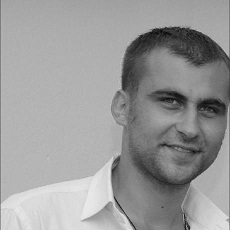

 
 
 

 
 
 
 
 
 
 
 
 

# MASLENKOV ALEKSANDR

## Contact Info

|Type of contact|Data|
|-----:|:------|
|A1(Viber):|<a href="tel:+48518328727">+48 518-328-727|
|Mail:|<a href = "mailto: maspoland22@gmail.com">maspoland22@gmail.com|
|Discord:|Maslik001|
|Skype:|Maslik|
|Linkedin|<a href = "https://www.linkedin.com/in/alexandr-maslenkov/">My Profile|
|GitHub:|<a href = "https://github.com/Maslik001">My Repository |

## About Me
Very passionate about web development. I like solving tasks, bringing the implementation to a logical solution. I love perfectionism in my work (I tend to pay attention to every detail and do not leave anything unfinished). I am a very sociable and tolerant kind of person. I do find common ground with the interlocutor pretty easily.
I do my very best to develop my professional skills.

    AnyOpportunityToDevelop (skills) => return theResultToYou

## Skills
	
|My skils|Level|
|:----|:----:|
|HTML|Experienced| 
|CSS (Bootstrap, SASS/SCSS, BEM)|Experienced|
|JavaScript (Fundamentals, ES6+, DOM, JSON, Asynchronous JavaScript)|Basic|
|Git/GitHub|Basic|
|Figma / Adaptive layout|Basic|

## Code Examples
    function find_max(nums) {
    let max_num = Number.NEGATIVE_INFINITY; // smaller than all other numbers
        for (let num of nums) {
            if (num > max_num) {
            max_num = num;
                }
            }
         return max_num;
         }

    find_max([11,10,30,68,-15,29,4]);

## Courses

`2022`

- [x]  Computer Academy STEP
Front-end development

`2017`

- [x]  IT-school "MELA ROSSA"
Front-end development

## Education

`2011`

- [x]  Mogilev State A. Kuleshov University, Higher education 
Faculty of Economics and Law , Jurisprudence Lawyer
	
 
	
`2006`

- [x]  Mogilev State Polytechnic College, Expert 
Technology maintenance and repair of electrical equipment, Diploma
in Engineering

## Languages
- Russian - native speaker.
- English - A2 (B1 in process…)

